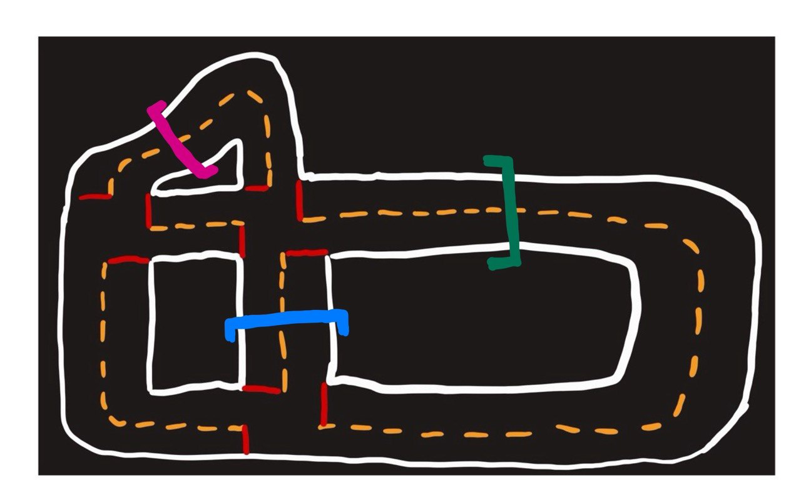
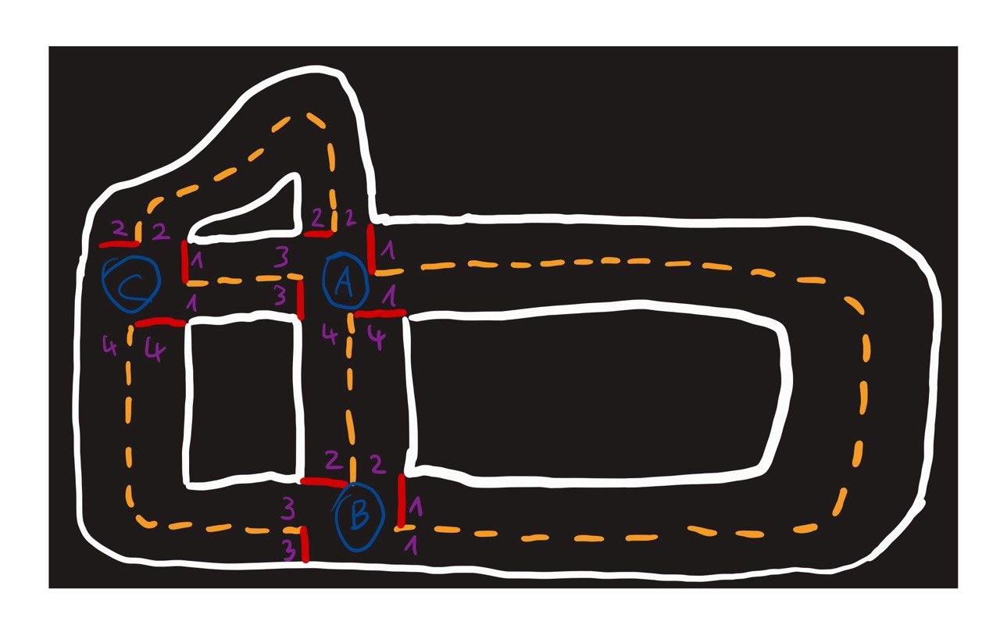

# Mapping & Path Finding

## Challenge 4

- Der Duckiebot bekommt eine Karte in Form eines Graphen die die Stadt beschreibt.
- Nun fährt der Duckiebot durch die Straßen.
- Dabei findet er Tore, die er auf die Graphenkanten mappt.
- Nachdem finden der Tore, fährt der Duckiebot die bunten Tore in der richtigen Reihenfolge ab.



## Ein Beispiel

Beispiel Stadt mit dictionary:

```
{ A:{ 1:(B,1), 2:(C,2), 3:(C,1), 4:(B,2)},
  B:{ 1:(A,1), 2:(A,4), 3:(C,4)},
  C:{ 1:(A,3), 2:(A,2) 4:(B,3)} }
```


